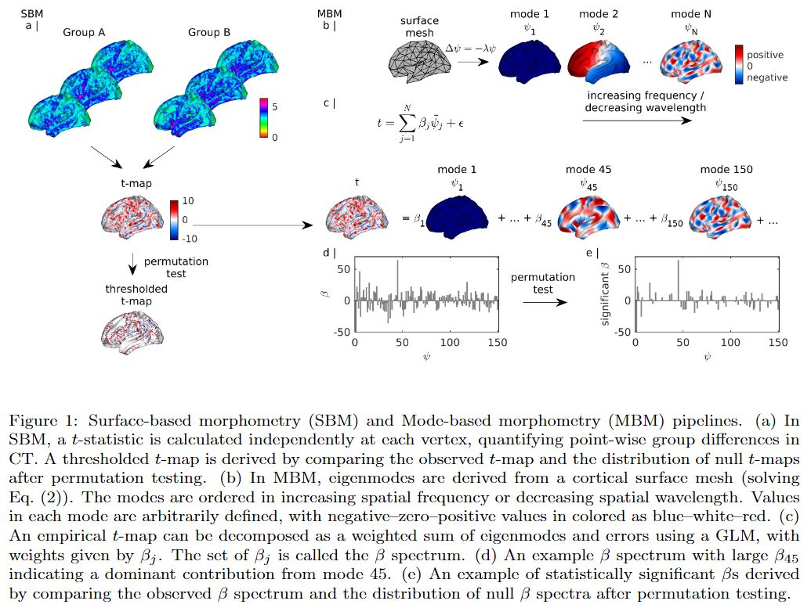
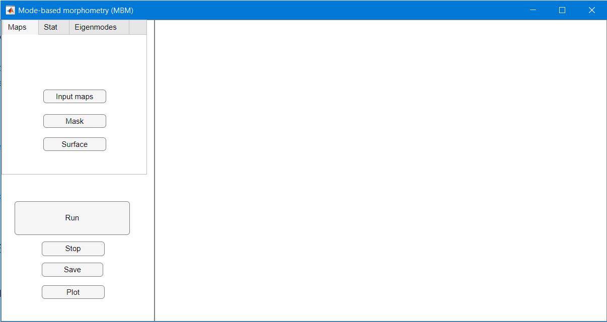

# MBM
Mode-based morphometry (MBM) is a toolbox for analysing anatomical variations at multiple spatial scales by using the fundamental, resonant modes—eigenmodes—of brain anatomy. The goal is to characterize a group average or group difference at multiple spatial scales by obtaining the spatial frequency spectrum, called beta spectrum, and patterns of its statistical map.

See "[Mode-based morphometry: A multiscale approach to mapping human neuroanatomy](https://www.biorxiv.org/content/10.1101/2023.02.26.529328v1)" for more details.

## File descriptions

In this package, we provide the following a main functions, demo script to run it, and complement folders:

1. `mbm_main.m`: main function to obtain the spatial frequency spectrum, called beta spectrum, the significant pattern, and the most influential modes of the statistical map representing the group average or group difference. 
2. `mbm_demo.m`: demo script to run `mbm_main.m`.
3. `mbm_app.mlapp`: app script for GUI of the main function.
3. `utils/`: dependent packages comprising of gifti-matlab (to read GIFTI file), PALM (to estimate a distribution tail), and fdr_bh (to use fdr correction).
4. `data/`: demo data to run the codes.
5. `func/`: functions used in the  main code for analysis and visualization.

## Installation

Download the repository. If you already have the packages in utils and would like to use yours, modify the paths in `mbm_app.mlapp` and `mbm_main.m` to point to them.

Read the comments and documentation within each code for usage guidance.

## Downloading data

Due to their file sizes exceeding the limit allowed by GitHub, you will need to fill the `data/` directories with data that you can download from this [OSF repository](https://osf.io/huz4e/). The total file size is 500 MB. 

## Running MBM by command lines

`mbm_main.m` executes the pipelines in Fig. 1. The input to `mbm_main.m` is a Matlab structure named MBM which includes:

•	A path to a text file of a list of anatomical maps to be analysed and a path to a mask to exclude elements of the maps from the analysis. Anatomical maps are expected as GIFTI files and projected on an average surface. In the example given in the demo code, the left fsaverage midthickness surface with 32492 vertices is used as an average template.

•	Parameters specifying the statistical test and an indicator matrix whose binary elements in each column indicate subjects belonging to a group. One-sample t-test, two-sample t-test, and one-way ANOVA are supported.

•	The eigenmodes (ψj  in Fig. 1) calculated from a surface mesh (a .vtk file) by surface_eigenmodes.py (see https://github.com/NSBLab/BrainEigenmodes/tree/main) and saved as a text file. Eigenmodes should be derived from the same average surface that the maps are projected on.

•	Parameters specifying the visualisation of the results.

The output of `mbm_main.m` are included in the struture mbm: the statistical map,  its p-values, thresholded statistical map, beta spectrum, its p-values, significant beta spectrum, the significant patterns, and the most influential modes.  Visualisation of the results are provided. 

Run 'help mbm_main' in Command Window or open 'mbm_main.m' to see the documentation on all the input and output parameters and their types. See 'mbm_demo.m' for examples.

## Running MBM by GUI

To use standalone app, install by using `MBMInstaller.exe'. After installation, open MBM app in your system. 

To use the GUI in Matlab, open 'mbm_app.mlapp' in Matlab and hit 'Run' in App Designer window. 

The app appears as shown below. On the top left, the input panel has three tabs: Maps, Stat, and Eigenmodes. The run panel is on the bottom left. The result panel is on the right.

 

To prepare the model:

- In the **Maps** tab, use the input buttons to open a file selection dialog box and load: 

•	'Map list': a text file of a list of input anatomical maps in GIFTI format.

•	'Mask': a text file containing a binary mask where values '1' or '0' indicating the vertices of the applied maps to be used or removed. 

•	'Surface': a vtk file containing a surface to plot the result. The surface should be the one that the eigenmodes are derived from and the anatomical maps are projected on.

•	choose the 'Hemisphere' to be analysed from the drop down list.

- In the **Stat** tab,
  
•	choose the 'Statistic test' from the drop down list.

•	use the button 'indicator matrix G' to open a file selection dialog box and load a text file containing a group indicator matrix [m subjects by k groups]. In the matrix, '1' or '0' indicates a subject in a group or not.

•	'Permutation': put the number of permutation in the statistical test.

•	'Pthr: tail approx': put the threshold of p-values for tail approximation. If the p-values are below Pthr, these are refined further using a tail approximation from the Generalise Pareto Distribution (GPD).

•	'P threshold': put the threshold of p-values for being significant.

•	check FDR box if using FDR correction.	

- In the **Eigenmodes** tab,
•	use the button 'Eigenmodes' to open a file selection dialog box and load a text file containing eigenmodes in columns.

•	'Number of modes': put the number of eigenmodes used for the analysis.

•	'Most influential modes': put the number of the most influential modes to plot.

To run the analysis:

- Press the 'Run' button. Once the analysis is finished, press 'Save' to save the structure 'MBM' containing the parameters and results in a .mat file. Press 'Plot' to show the results on the result panel. If required, press 'Stop' to interupt the analysis. For 5000 permutations, the analysis need approximately one hour to run.

Results:

- The result panel comprises the t-map, the thresholded t-map, the beta spectrum, the significant pattern, and most influential modes. 

## Example data are in the the data folder. 

•	Input maps are in the 'thickness' folder.

•	The list of input maps is 'map_list.txt'.

•	The binary map is 'mask_S1200.L.midthickness_MSMAll.32k_fs_LR.txt'.

•	The surface vtk file is 'fsLR_32k_midthickness-lh.vtk'

•	The indicator matrix G is in 'G_one_sample.txt' or 'G_two_sample.txt'.

•	The eigenmodes are in 'evec_501_masked_S1200.L.midthickness_MSMAll.32k_fs_LR.txt'.

## Original data

Original empirical data are from the [Human Connectome Project](https://db.humanconnectome.org/). Please consult the link for detailed information about access, licensing, and terms and conditions of usage.

## Additional functions

Useful functions relating to eigenmodes may be found at https://github.com/NSBLab/BrainEigenmodes/tree/main, including:

Example of how to use `surface_eigenmodes.py` to calculate surface and/or
volume geometric eigenmodes (See `demo_eigenmode_calculation.sh`),

Visualising an eigenmode or a map (See `demo_eigenmode_visualization.m`).

## Compatibility

The codes have been tested on versions of MATLAB from R2019b to R2023a.

## Citation

If you use our code in your research, please cite us as follows:

[PREPRINT]  View ORCID Profile Trang Cao,  James C. Pang,  Ashlea Segal,  Yu-Chi Chen,  Kevin M. Aquino,  Michael Breakspear,  Alex Fornito, Mode-based morphometry: A multiscale approach to mapping human neuroanatomy, bioRxiv (2023) (DOI: [10.1101/2023.02.26.529328](https://www.biorxiv.org/content/10.1101/2023.02.26.529328v1))

## Further details

Please contact trang.cao@monash.edu if you need any further details.
