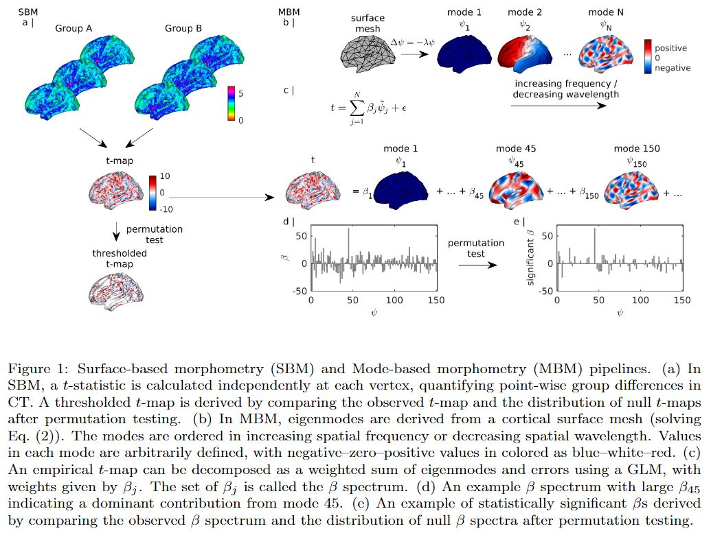
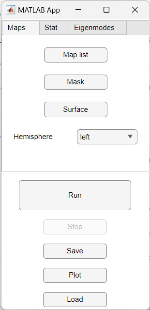

# MBM
Mode-based morphometry (MBM) is a toolbox for analysing anatomical variations at multiple spatial scales by using the fundamental, resonant modes—eigenmodes—of brain anatomy. The goal is to characterize a group average or group difference at multiple spatial scales by obtaining the spatial frequency spectrum, called beta spectrum, and patterns of its statistical map.

See "[Mode-based morphometry: A multiscale approach to mapping human neuroanatomy](https://www.biorxiv.org/content/10.1101/2023.02.26.529328v1)" for more details.

## File descriptions

In this package, we provide the following a main function, demo script to run it, and complement folders:

  1. `mbm_main.m`: main function to obtain the spatial frequency spectrum, called beta spectrum, the significant pattern, and the most influential modes of the statistical map representing the group average or group difference. 
  2. `mbm_demo_sim.m`,  `mbm_demo_emp.m`: demo scripts to run `mbm_main.m`. `mbm_demo_prerequisite.m` needs to be run before running the demo in order to generate the list of paths to maps.
  3. `mbm_app.mlapp`: app script for GUI of the main function.
  4. `utils/`: dependent packages comprising of gifti-matlab (to read GIFTI file), PALM (to estimate a distribution tail), and fdr_bh (to use FDR correction).
  5. `data/`: demo data to run the demo codes.
  6. `func/`: functions used in the main code for analysis and visualization.
  7. `figure/`: figures

## Installation

Download the repository. If you already have the packages in utils and would like to use yours, modify the paths in `mbm_app.mlapp` and `mbm_main.m` to point to them.

Read the comments and documentation within each code for usage guidance.

## Downloading data

Due to the file size exceeding the limit allowed by GitHub, you will need to fill the `data/` directories with data that you can download from this [OSF repository](https://osf.io/huz4e/). The total file size is 500 MB. 

## Running MBM by command lines

`mbm_main.m` executes the pipelines in Fig. 1. The inputs to `mbm_main.m` combined in a Matlab structure named `MBM` are:

  *  A path to anatomical maps to be analysed and a path to a mask to exclude elements of the maps from the analysis. Anatomical maps are expected as GIFTI, NIFTI, or .mgh files and projected on an average surface. In the example given in `mbm_demo_sim.m`, the left fsaverage midthickness surface with 32492 vertices is used as an average template.

  * Parameters specifying the statistical test and a design matrix representing effects on subjects. One-sample t-test, two-sample t-test,  one-way ANOVA, and ANCOVA (two groups) are supported.

  * The eigenmodes (ψj  in Fig. 1) or a surface mesh (a .vtk file) to calculate the eigenmodes. Eigenmodes should be derived from the same average surface that the maps are projected on.

  * Parameters specifying the visualisation of the results.

The outputs of `mbm_main.m` combined in the struture `MBM` are: the statistical map,  its p-values, thresholded statistical map, beta spectrum, its p-values, significant beta spectrum, the significant patterns, and the most influential modes.  Visualisation of the results are provided. 

Run `help mbm_main` in Command Window or open `mbm_main.m` to see the documentation on all the input and output parameters and their types. See `mbm_demo_sim.m` and `mbm_demo_emp.m` for examples.

## Running MBM by GUI

[To use standalone app, install by using `MBMInstaller.exe'. After installation, open MBM app in your system.]: 

To use the GUI in Matlab, open `mbm_app.mlapp` by double clicking.  

The app appears as shown below. On the top, the input panel has three tabs: **Maps**, **Stat**, and **Eigenmodes**. The run panel is on the bottom.

 

The inputs to run the model are as follows.

  * In the **Maps** tab: 

    * *Map list*: load a text file of a list of input anatomical measure maps.

    * *Mask*: load a text file containing a binary mask where values '1' or '0' indicating the vertices of the applied maps to be used or removed. 

    * *Surface*: load a vtk file containing a surface to plot the result. The surface should be the one that the eigenmodes are derived from and the anatomical maps are projected on.

    * *Hemisphere*: choose to be analysed from the drop down list.

  * In the **Stat** tab:
  
    * *Statistic test*: choose from the drop down list.

    * *design matrix G*: load a text file containing a design matrix [m subjects by k effects]. For the design matrix in the statistical test of *one sample* (one column), *two sample* (two columns), *one way ANOVA* (k columns), '1' or '0' in each column indicates a subject in a group or not. For the design matrix in the statistical test of *ANCOVA*: '1' or another number (e.g., '2') in the first column indicates the group effect (similar to the input file for mri_glmfit in Freesurfer) and discrete or continuous numbers in the second to k-th columns indicates covariates.

  	* *Permutation*: put the number of permutations in the statistical test.

    * *Pthr: tail approx*: put the threshold of p-values for tail approximation. If the p-values are below Pthr, these are refined further using a tail approximation from the Generalise Pareto Distribution (GPD).

    * *P threshold*: put the threshold of p-values for being significant.

    * *FDR*: mark if using FDR correction.	

  * In the **Eigenmodes** tab,

    * *Eigenmodes*: load a text file containing eigenmodes in columns.

    * *Number of modes*: put the number of eigenmodes used for the analysis.

    * *Most influential modes*: put the number of the most influential modes to plot.

To run the analysis:

  * Press *Run*.
  * Press *Save* when the analysis has finished to save the structure 'MBM' containing the parameters and results in a .mat file.
  * Press *Plot* to plot the results. The result panel comprises the t-map, the thresholded t-map, the beta spectrum, the significant pattern, and most influential modes. 
  * If required, press *Stop* to interupt the analysis. For 5000 permutations, the analysis needs approximately one hour to run.

## Example data are in the data folder. 

  * Input thickness maps are in the *thickness* folder.

  * The list of input maps is `map_filename.txt`. `mbm_demo_prerequisite.m` needs to be run before running the demos in order to generate `map_full_path.txt` containing the paths to these maps.

  * The binary map is `mask_S1200.L.midthickness_MSMAll.32k_fs_LR.txt`.

  * The vtk file of the surface to plot is `fsLR_32k_midthickness-lh.vtk`.

  * The design matrix G is in `G_one_sample.txt`, `G_two_sample.txt`, or `G_ANCOVA.txt`.

  * The eigenmodes are in `evec_501_masked_S1200.L.midthickness_MSMAll.32k_fs_LR.txt`.

## Original data

Original empirical data are from the [Human Connectome Project](https://db.humanconnectome.org/) and [HCP Early Psychosis (HCP-EP)](https://www.humanconnectome.org/study/human-connectome-project-for-early-psychosis). Please consult the link for detailed information about access, licensing, and terms and conditions of usage.

## Additional functions

Useful functions relating to eigenmodes may be found at https://github.com/NSBLab/BrainEigenmodes/tree/main, including:

Example of how to use `surface_eigenmodes.py` to calculate surface and/or
volume geometric eigenmodes (See `demo_eigenmode_calculation.sh`),

Visualising an eigenmode or a map (See `demo_eigenmode_visualization.m`).

## Compatibility

The codes run on versions of MATLAB from R2022a to R2024a.

## Citation

If you use our code in your research, please cite us as follows:

Trang Cao,  James C. Pang,  Ashlea Segal,  Yu-Chi Chen,  Kevin M. Aquino,  Michael Breakspear,  Alex Fornito, Mode-based morphometry: A multiscale approach to mapping human neuroanatomy, (DOI: [10.1002/hbm.26640](https://doi.org/10.1002/hbm.26640))

## Further details

Please contact trang.cao@monash.edu if you need any further details.
