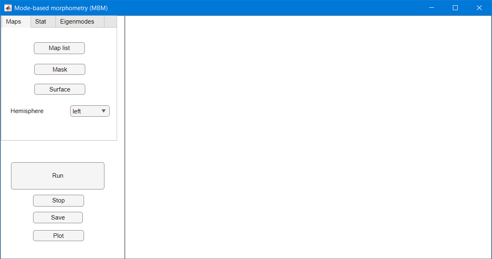

# MBM
Mode-based morphometry (MBM) is a toolbox for analysing anatomical variations at multiple spatial scales by using the fundamental, resonant modes—eigenmodes—of brain anatomy. The goal is to characterize a group average or group difference at multiple spatial scales by obtaining the spatial frequency spectrum, called beta spectrum, and patterns of its statistical map.

See "[Mode-based morphometry: A multiscale approach to mapping human neuroanatomy](https://www.biorxiv.org/content/10.1101/2023.02.26.529328v1)" for more details.

## File descriptions

In this package, we provide the following a main functions, demo script to run it, and complement folders:

1. `mbm_main.m`: main function to obtain the spatial frequency spectrum, called beta spectrum, the significant pattern, and the most influential modes of the statistical map representing the group average or group difference. 
2. `mbm_demo.m`: demo script to run `mbm_main.m`.
3. `mbm_app.mlapp`: app script for GUI of the main function.
3. `utils/`: dependent packages comprising of gifti-matlab (to read GIFTI file), PALM (to estimate a distribution tail), and fdr_bh (to use fdr correction).
4. `data/`: demo data to run the codes.
5. `func/`: functions used in the  main code for analysis and visualization.

## Installation

Download the repository. If you already have the packages in utils and would like to use yours, modify the paths in `mbm_app.mlapp` and `mbm_main.m` to point to them.

Read the comments and documentation within each code for usage guidance.

## Downloading data

Due to their file sizes exceeding the limit allowed by GitHub, you will need to fill the `data/` directories with data that you can download from this [OSF repository](https://osf.io/huz4e/). The total file size is 500 MB. 

## Running MBM by command lines

`mbm_main.m` executes the pipelines in Fig. 1. The input to `mbm_main.m` is a Matlab structure named MBM which includes:

•	A path to a text file listing all the anatomical maps to be analysed and a path to a mask to exclude elements of the maps from the analysis. Anatomical maps are expected as GIFTI files and projected on an average surface. In the example given in the demo code, the left fsaverage midthickness surface with 32492 vertices is used as an average template.

•	Parameters specifying the statistical test and an indicator matrix whose elements in each column indicate subjects belonging to a group. One-sample t-test, two-sample t-test, and one-way ANOVA are supported.

•	The eigenmodes (ψj  in Fig. 1) calculated from a surface mesh (a .vtk file) by surface_eigenmodes.py (see https://github.com/NSBLab/BrainEigenmodes/tree/main) and saved as a text file. Eigenmodes should be derived from the same average surface that the maps are projected on.

•	Parameters specifying the visualisation of the results.
The output of `mbm_main.m` are included in the struture mbm: the statistical map,  its p-values, thresholded statistical map, beta spectrum, its p-values, significant beta spectrum, the significant patterns, and the most influential modes.  Visualisation of the results are provided. 

## Running MBM by GUI

•	Starting the app by double click `mbm_app.mlapp'. The GUI appears as shown below. On the top left, the input panel has three tabs: Maps, Stat, and Eigenmodes. The run panel is on the bottom left. The result panel is on the right.

 

•	Use input buttons 'Input maps', 'Mask', 'Surface', 'indicator matrix G', 'Eigenmodes' to open file selection dialog box to choose GIFTI files of input anatomical maps, a binary mask file, a surface vtk file, a text file containing a group indicator matrix, a text file containing eigenmodes in columns. 

•	Choose the statistic tests and the hemisphere to be analysed from the drop down list. 

•	Check FDR box if using FDR correction.

•	Put in the parameters of the analysis: number of permutation, threshold of p-values for tail approximation, threshold of p-values for being significant, number of eigenmodes for the analysis, and number of the most influential modes to plot.

•	Once putting all the inputs, press the 'Run' button to run the analysis. Press 'Stop' to interupt the analysis. Once the analysis is finished, press 'Save' to save the structure 'mbm' containing the parameters and results in a .mat file. Press 'Plot' to show the results on the result panel.

•	The result panel comprises the t-map, the thresholded t-map, the beta spectrum, the significant pattern, and most influential modes. 

## Example data are in the the data folder. 

•	Input maps are in the 'thickness' folder.

•	The list of input maps is 'map_list.txt'.

•	The binary map is 'mask_S1200.L.midthickness_MSMAll.32k_fs_LR.txt'.

•	The surface vtk file is 'fsLR_32k_midthickness-lh.vtk'

•	The indicator matrix G is in 'G_one_sample.txt' or 'G_two_sample.txt'.

•	The eigenmodes are in 'evec_501_masked_S1200.L.midthickness_MSMAll.32k_fs_LR.txt'.

## Original data

Original empirical data are from the [Human Connectome Project](https://db.humanconnectome.org/). Please consult the link for detailed information about access, licensing, and terms and conditions of usage.

## Additional functions

Useful functions relating to eigenmodes may be found at https://github.com/NSBLab/BrainEigenmodes/tree/main, including:

Calculating surface and/or volume geometric eigenmodes (See `demo_eigenmode_calculation.sh`),

Visualising an eigenmode or a map (See `demo_eigenmode_visualization.m`).

## Compatibility

The codes have been tested on versions of MATLAB from R2019b to R2023a.

## Citation

If you use our code in your research, please cite us as follows:

[PREPRINT]  View ORCID Profile Trang Cao,  James C. Pang,  Ashlea Segal,  Yu-Chi Chen,  Kevin M. Aquino,  Michael Breakspear,  Alex Fornito, Mode-based morphometry: A multiscale approach to mapping human neuroanatomy, bioRxiv (2023) (DOI: [10.1101/2023.02.26.529328](https://www.biorxiv.org/content/10.1101/2023.02.26.529328v1))

## Further details

Please contact trang.cao@monash.edu if you need any further details.
